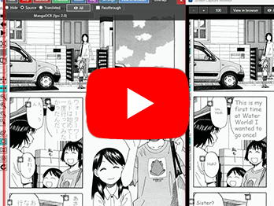
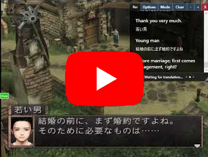
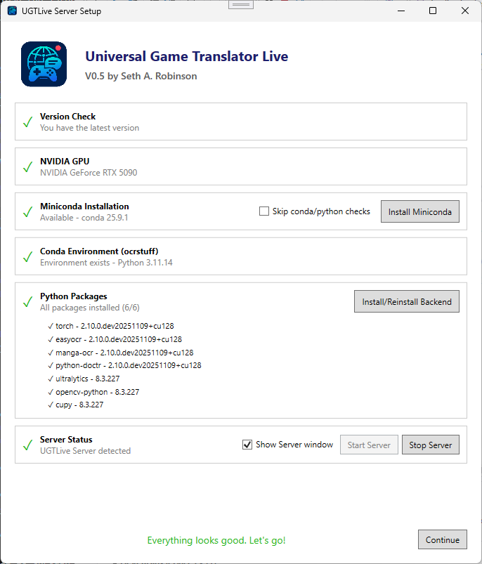
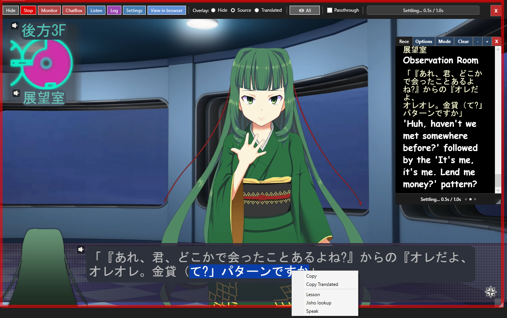
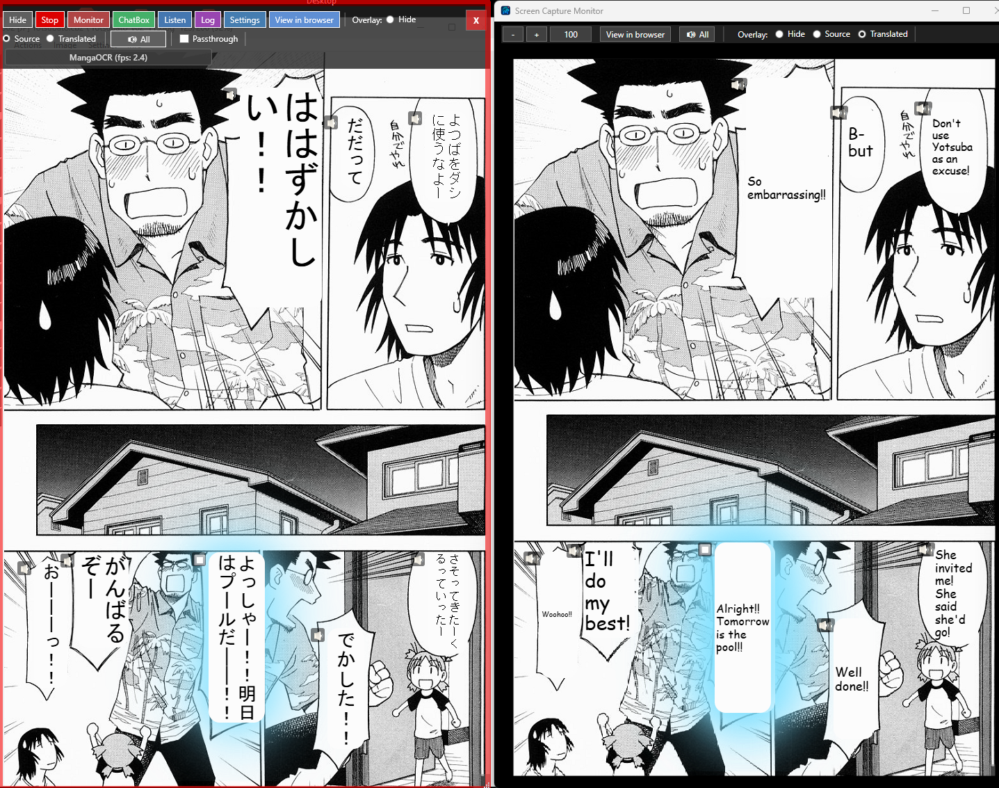
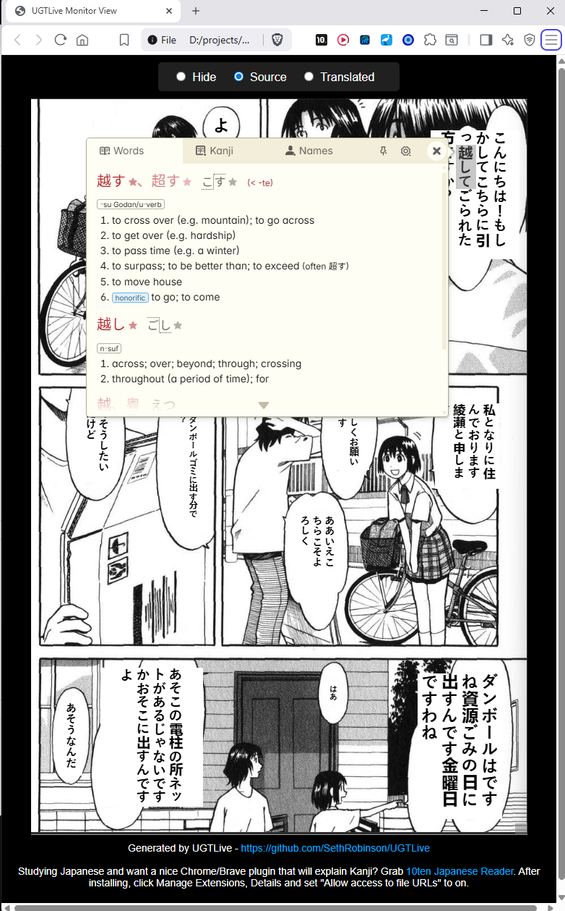

## Universal Game Translator Live

[](https://www.rtsoft.com/files/UniversalGameTranslatorLive_Windows.zip)

## Video Demonstrations

<table>
<tr>
<td align="center" valign="top" width="50%">
<a href="https://www.youtube.com/watch?v=eIGHV4-BMjY">

</a>
<br/>
Video showing reading and translating vertical Japanese manga (V1.00)
</td>
<td align="center" valign="top" width="50%">
<a href="https://www.youtube.com/watch?v=PFrWheMeT5k">

</a>
<br/>
Video showing live game translation (old version)
</td>
</tr>
</table>


## Description 

An easy-to-use GUI-based Windows tool that performs "live" translations of anything on the screen using modern machine learning and AI technology.  Also has a "Snapshot" mode for a more traditional system.

Requires **Windows** and an **NVidia RTX 20/30/40/50** series card with 8+ GB VRAM

Features:

* Supports 26 languages: Japanese, English, Chinese (Simplified & Traditional), Korean, Spanish, French, Italian, German, Portuguese, Russian, Polish, Dutch, Swedish, Czech, Hungarian, Romanian, Greek, Ukrainian, Turkish, Arabic, Hindi, Thai, Vietnamese, Indonesian, and Persian (Farsi)
* Built for real-time use, detects changes and translates when things "settle"
* "Snapshot" feature for non-live use as well
* Can read/render/select/speak vertical Japanese in manga, good for language learning
* Out of the box you can do local GPU accelerated OCR (Easy OCR, Manga OCR, Paddle OCR, docTR, Windows OCR, Google Cloud Vision)
* Optional features (translation, speech) enabled with API keys for OpenAI, Gemini, ElevenLabs, Microsoft Speech, and Google Translate (which does have a free mode)
* Audio "Page Reading" feature (including a mode for top down, right to left for manga)
* "Export to HTML" allows you to open the screen in your web browser, good for using plugins to go over Kanji, stuff like that
* Flexible interface, adjust the app's rectangle to translate anything on your desktop.  Passthrough checkbox allows you to interact with things under the app during realtime translation
* Robust global hotkey system that allow allows gamepad buttons to be used
* New "GPU Service Console" feature, makes it easy to install the GPU backend services you want
* (fairly) accurate color detection system replaces existing text in realtime, works with all OCR modes
* Some extra stuff for Japanese learners, like single clicks for Jisho lookup and lessons for any text

## License:  BSD-style attribution, see [LICENSE.md](LICENSE.md)

## Download the latest version [here](https://www.rtsoft.com/files/UniversalGameTranslatorLive_Windows.zip) (Windows, NVidia GPU) 

## Screenshots

<table>
<tr>
<td><a href="media/easy_setup.png"></a></td>
<td><a href="media/japanese_game.png"></a></td>
<td><a href="media/manga_ocr_to_english.png"></a></td>
<td><a href="media/manga_web_export_with_10ten.png"></a></td>
</tr>
</table>

# History


**V1.04 Dec 27th, 2025** - Added "Thinking mode" checkbox to OpenAI and Gemini models, defaults to off for speed

**V1.03 Dec 25th, 2025** - Added llama.cpp routing mode support, RTX 20x support (untested), support for latest OpenAI/Gemini models

**V1.02 Dec 1st, 2025** - * Added 9 more languages, Snapshot button tweaks, "Show detailed Log" button during service installs, language selection GUi improved

**V1.01 Nov 30th, 2025** - Added new "Snapshot" mode feature, now remembers window pos/sizes (PR by [jeffvli](https://github.com/jeffvli) ), new hotkey binding for overlay mode "previous"

**V1.00 Nov 24th, 2025** - Major milestone release! Paddle OCR added, new "GPU Service Console" system that makes it easier to add new backend features, better color detection (which works with all OCR methods now)

**V0.60 Nov 17th, 2025** - New customizable global hotkey system, New Page Reader/preload audio system, improved OCR capturing (thx [thanhkeke97](https://github.com/thanhkeke97)) with passthrough option, new log dialog, Settings dialog now is organized with tabs, lesson and jisho lookup added

**V0.52 Nov 13th, 2025** - Manga OCR mode now ignores furigana by default, improved Ollama support, misc improvements

**V0.51 Nov 11th, 2025** - Added llama.cpp support (llm), added Google Cloud Vision support (OCR), added OCR fps display

**V0.50 Nov 10th, 2025** - Huge update to everything, added vertical Manga support, reworked backend completely, now detects original foreground/background colors (badly, but it's a start), much simpler to install, no more fussing with .bat files and servers, it's all handled internally from the main app now.  Lot of little QOL and features added.

# Download & Install

* Download the latest version [here](https://www.rtsoft.com/files/UniversalGameTranslatorLive_Windows.zip) and unzip it somewhere

* Run *UGTLive.exe*

* The GPU Service Console will open.  Click "Install" on the services to install them one by one.  (I suggest all.. uh.. it takes a while) Next, click the "autostart" checkbox on all of them, you should be good to go.

* Drag the main window rectangle around something you want to translate (note:  examples test images found in services/shared/test_images) and click the "Start" button.  Click Settings and you can enable translation, or change the OCR or translation methods.

## How to update ##

UGTLive will automatically check for updates when you start it. If a new version is available, you'll see a notification asking if you want to download it. To update:

1. Download the latest version from the notification or from [here](https://www.rtsoft.com/files/UniversalGameTranslatorLive_Windows.zip)
2. Close UGTLive if it's running
3. Extract the new files over your existing installation
4. After starting UGTLive, it wil show a warning if a backend has changed and you should reinstall it.

## Tips

 * Is it doing a bad job?  Try changing the OCR engine in Settings, you can flip back and forth live.
 * Your privacy is important. The only web calls this app makes are to check this GitHub's media/latest_version_checker.json file to see if a new version is available. Be aware that if you use a cloud service for the translation (Gemini is recommended), they will see what you're translating. If you use Ollama, nothing at all is sent out.
 * For just OCR, it's ready to go, for translation/speaking, cloud services are used (you enter your API key, etc.  The settings screen has info on how to do this)
 * While the actual .exe is signed by RTsoft, the .bat files it uses under the hood aren't, so you get ugly "This is dangerous, are you sure you want to run it?" messages the first time.
 * Your RTX Pro 6000 isn't detected?  Uh, my bad.  Let me know, I'll add it
 * AMD GPU support? Sorry not yet.  I don't have one!
 * Can't click on the text overlays on the main window?  Make sure "Passthrough" *is not* checked
 * What's the best settings for translation?  I like gemini-2.5-flash-lite. It's just very fast.
 
 ## How to run it COMPLETELY LOCALLY and free, even the translations
 
 If you don't mind a bit slower speed to translate a screen (depends on a lot of things, but around 6 seconds on a 5090?) then this is for you! It's actually really easy to setup an Ollama or llama.cpp server (optionally) right on the same computer. 
 
 Here's how to setup llama.cpp:
 
 * Download the one that looks similar to llama-b7083-bin-win-cuda-12.4-x64.zip from the latest [releases](https://github.com/ggml-org/llama.cpp/releases/latest), unzip it in a folder somewhere.
 
 * Download a model you like that will fit in your GPU's VRAM and put it in the same folder.  ([example of one for Japanese translation](https://huggingface.co/mradermacher/Flux-Japanese-Qwen2.5-32B-Instruct-V1.0-GGUF), the Q2_K version works fine, it will fit with UGTLive's other stuff in under 24GB of VRAM)

 Create a text file called run_server.bat in that directory, cut and paste this as the contents (edit the model filename name to match what you've downloaded):

 ```
 @echo off
REM MODEL path
set "MODEL=Flux-Japanese-Qwen2.5-32B-Instruct-V1.0.Q2_K.gguf"

REM To change context size (takes more VRAM) try changing -c to
REM  -c 32768 ^

REM To allow hosting beyond your own computer try adding:
REM  --host 0.0.0.0 ^

: Let's launch a webbrowser now as we can't later, useful for making sure it's working, and testing the model

start "" http://localhost:5000

llama-server ^
  -m "%MODEL%" ^
  --port 5000 ^
  --jinja ^
  -ngl 999 ^
  -c 8196 ^
  --cache-type-k q8_0 ^
  --cache-type-v q8_0

pause
```

Now, just double click the run_server.bat file we made and your server should start and and a browser window should open where you can test it, maybe ask it to translate some text, make sure it can.

After that's verified to work, in UGTLive's Translation settings, choose llama.cpp and set the URL to http://localhost and the port to 5000 as that's what we have in the .bat file.  It should now be able to do both OCR and translation of anything, completely locally with no cloud services! (well, you can always mix and match, for example, I still only have cloud text to speech systems setup)

## Problems?  Read this!

* First, it's helpful to see what the backend is doing.  Click the "Show server window" option.  It scrolls fast but it might hold some clues.
* Second, click the "Log" button.  It will show any errors, especially useful to figure out why a cloud service is rejected your requests.
* Try deleting the config.txt and hotkeys.txt to reset settings to default.  Something could be broken with that when upgrading.
* Try re-installing the backend by clicking the "Install/Reinstall Backend" button. (especially if something has changed with the version or your video card)

Still won't work? Open an issue on [here](https://github.com/SethRobinson/UGTLive/issues) or post in this project's [discussions](https://github.com/SethRobinson/UGTLive/discussions) area.

## When I take a screenshot, capture or use my computer remotely the UGTLive windows disappear!

* Sorry, this is a side effect of the tricks used to allow it to render and capture in the same place.  You can disable this by checking the "Make our windows visible in screenshots", however it makes the entire app a lot less useful.  Another way to take a movie would be to capture directly from your computer's HDMI out.  I think.

## Why are you using an LLM instead of DeepL/Google Translate? ##

I think this is the obvious way of the future - by editing the LLM prompt template in settings, you have amazing control.  For example, you can ask it to translate things more literally (good for language learning) if needed.  (Oh, google translate is actually supported now too)

It intelligently understands the difference between a block of dialog and three options that the user can choose from and inserts linefeeds at the correct positions.

Another important advantage is spatial understanding - instead of just sending individual lines to be translated, the LLM is sent all the text at once, complete with positioning/rect information.  We allow the LLM to make decisions like "move this text over to that block" or even create its own new blocks.

One key setting is the "Max previous context".  This is recent earlier dialog being sent along with the new request, this allows the LLM to understand "the story thus far" which allows it to give more accurate translations.  In general, you don't want buttons like "Options" "Talk" "X" to be sent in this "context", so the "Min Context Size" allows you to have it ignore smaller words and only send larger dialog.

You can also do dumb things like ask that every character talk like a drunk pirate and that's no problem too.

In the future, we can probably send the entire screenshot directly to an LLM and get answers at a high FPS, but for now, due to speed/cost it makes sense to do our own (lower quality) OCR and send text only.

## For developers - How to compile it ##

* Open the solution with Visual Studio 2022 and click compile.  I can't remember if it's going to automatically download the libraries it needs or not.

**Credits and links**
- Written by Seth A. Robinson (seth@rtsoft.com) twitter: @rtsoft - [Codedojo](https://www.codedojo.com), Seth's blog
- Code contributions from [thanhkeke97](https://github.com/thanhkeke97) and [jeffvli](https://github.com/jeffvli)
- [EasyOCR](https://github.com/JaidedAI/EasyOCR) - GPU-accelerated OCR supporting 80+ languages
- [Manga OCR](https://huggingface.co/kha-white/manga-ocr-base) - Specialized OCR for Japanese manga text recognition
- [docTR](https://github.com/mindee/doctr) - Document text recognition library with transformer architectures
- [Manga109 YOLO](https://huggingface.co/deepghs/manga109_yolo) - YOLO model for manga text region detection
- [Ultralytics YOLO](https://github.com/ultralytics/ultralytics) - YOLO framework for object detection

 Other open source translator projects you might want to try:
 - [Universal Game Translator](https://github.com/SethRobinson/UGT)
 - [RSTGameTranslation](https://github.com/thanhkeke97/RSTGameTranslation)
 - [LunaTranslator](https://github.com/HIllya51/LunaTranslator)

Plug: Also check out [UGTBrowser](https://chromewebstore.google.com/detail/ugtbrowser/ccpaaggcacbmdbjhclgggndopoekjfkc), a Chrome/Brave extension version I made for inline higher quality LLM-based web translation that won't mess up the images/formatting.

*This project was developed with assistance from AI tools for code generation and documentation.*