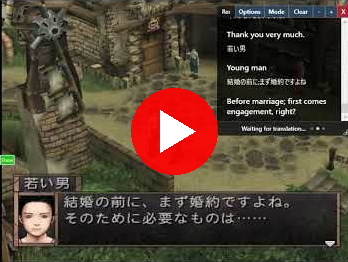

## Universal Game Translator Live

## Description 

An easy to use GUI-based Windows tool that performs "live" translations of anything on the screen.

Requires **Windows** and an **NVidia RTX 30/40/50** series card.

Features:

* New "Easy setup", don't have to run .bat files and such anymore, it internally uses conda and python to set up its own environment that won't screw with your system
* Out of the box you can do local GPU accerlated OCR (Easy OCR, Manga OCR, docTR, Windows OCR)
* Optional cloud services supported: OpenAI, Gemini, Elevenlabs, Microsoft Speech
* Can read/render/select/speak vertical Japanese in Manga, good for language learning.
* "Export to HTML" allows you to open the screen in your web browser, good for using plugins to go over Kanji, stuff like that
* Flexible interface, can use chatbox overlays or render a separate monitor window with changes.  Can target specific areas on your screen

License:  BSD-style attribution, see [LICENSE.md](LICENSE.md)

## Download the latest version [here](https://www.rtsoft.com/files/UniversalGameTranslatorLive_Windows.zip) 

*Things to know:*

 * This is mostly tested with Japanese to English translations
 * Windows and NVIDIA 30/40/50 series cards only.  Minimum VRAM: 8 GB.  OCR operations are local and GPU accelerated
 * Your privacy is important. The only web calls this app makes are to check this GitHub's media/latest_version_checker.json file to see if a new version is available. Be aware that if you use a cloud service for the translation (Gemini is recommended), they will see what you're translating. If you use Ollama, nothing at all is sent out.
 * For just OCR, it's ready to go, for translation/speaking, cloud services are used (you enter your API key, etc.  The settings screen has info on how to do this)
* While the actual .exe is signed by RTsoft, the .bat files it uses under the hood aren't, so you get ugly "This is dangerous, are you sure you want to run it?" messages the first time.
* Your RTX Pro 6000 isn't detected?  You can manually run webserver/_NVidia50Series.bat to install the 50 series backend, should work fine.
* AMD GPU support?  Well, I don't have one, but later this could be added by tweaking webserver/SetupServerCondaEnv.bat and adding a _AMDGPU.bat or something.

# History

V0.50 Nov 10th, 2025 - Huge update to everything, added vertical Manga support, reworked backend completely, now detects original foreground/backgroind colors (badly, but it's a start)

# Download & Install

* Download the latest version [here](https://www.rtsoft.com/files/UniversalGameTranslatorLive_Windows.zip) and unzip it somewhere

* Run *UGTLive.exe*

* It will go through a self check and install things if needed.  The entire setup can take up to 30 minutes, it's a lot to download.  It will autodetect your video card, it does need an NVidia RTX 30/40/50 series card with the latest NVidia drivers.

## How to update your version ##

UGTLive will automatically check for updates when you start it. If a new version is available, you'll see a notification asking if you want to download it. To update:

1. Download the latest version from the notification or from [here](https://www.rtsoft.com/files/UniversalGameTranslatorLive_Windows.zip)
2. Close UGTLive if it's running
3. Extract the new files over your existing installation
4. After starting UGTLive, you should probably run the *Install/Reinstall Backend* option to be safe, if some new OCR method was added that requires new libraries, this will fix it.

## Problems?  Read this!

* First, it's helpful to see what the backend is doing.  Click the "Show server window" option.  It scrolls fast but it might hold some clues.
* Second, click the "Log" button.  It also scrolls by fast but may have some good info.
* Try re-installing the backend by clicking the "Install/Reinstall Backend" button. (especially if something has changed with the version or your video card)

Still won't work? Open an issue on [here](https://github.com/SethRobinson/UGTLive/issues) or post in this project's [disccusions](https://github.com/SethRobinson/UGTLive/discussions) area.

## Keyboard Shortcuts for UGTLive

| Shortcut  | Function  |
|-----------|-----------|
| Shift+S | Start/Stop OCR |
| Shift+M | Show/Hide Monitor Window |
| Shift+C | Show/Hide ChatBox |
| Shift+P | Show/Hide Settings |
| Shift+L | Show/Hide Log Console |
| Shift+H | Show/Hide Main Window |

## Why are you using an LLM instead of DeepL/Google Translate? ##

I think this is the obvious way of the future - by editing the LLM prompt template in settings, you have amazing control.  For example, you can ask it to translate things more literally (good for language learning) if needed. 

It intelligently understands the difference between a block of dialog and three options that the user can choose from and inserts linefeeds at the correct positions.

Another important advantage is spatial understanding - instead of just sending individual lines to be translated, the LLM is sent all the text at once, complete with positioning/rect information.  We allow the LLM to make decisions like "move this text over to that block" or even create its own new blocks.

One key setting is the "Max previous context".  This is recent earlier dialog being sent along with the new request, this allows the LLM to understand "the story thus far" which allows it to give more accurate translations.  In general, you don't want buttons like "Options" "Talk" "X" to be sent in this "context", so the "Min Context Size" allows you to have it ignore smaller words and only send larger dialog.

You can also do dumb things like ask that every character talk like a drunk pirate and that's no problem too.

In the future, we can probably send the entire screenshot directly to an LLM and get answers at a high FPS, but for now, due to speed/cost it makes sense to do our own (lower quality) OCR and send text only.

## For developers - How to compile it ##

* Open the solution with Visual Studio 2022 and click compile.  I can't remember if it's going to automatically download the libraries it needs or not.

**Credits and links**
- Written by Seth A. Robinson (seth@rtsoft.com) twitter: @rtsoft - [Codedojo](https://www.codedojo.com), Seth's blog
- [thanhkeke97](https://github.com/thanhkeke97)
- [EasyOCR](https://github.com/JaidedAI/EasyOCR)

Also check out [UGTBrowser](https://chromewebstore.google.com/detail/ugtbrowser/ccpaaggcacbmdbjhclgggndopoekjfkc), a Chrome/Brave extension version for inline web translation.

*This project was developed with assistance from AI tools for code generation and documentation.*